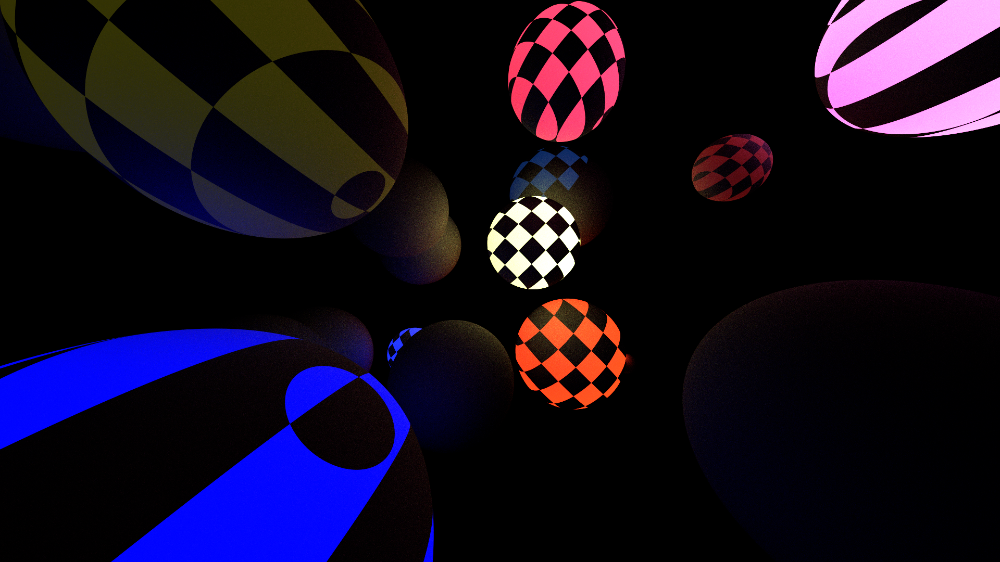

Simple raytracing engine using wgpu + winit. 
This project was mainly for learning so you most likely do not want to copy any of my spagetti code

## Controls
### Movement
- **WASD**

### Camera
- **Ctrl + Scroll**: Zoom+
- **Right Click** look around

Note: The camera is pretty bad and make sure not to look up or down - I still have not figured out quaternions yet

### Render
- **R**: Randomize colors
- **J**: Decrease samples per pixel
- **K**: Increase samples per pixel
- **U**: Decrease total frames for render
- **I**: Increase total frames for render

Note: frames refers to how the code produces a texture each frame, which are then averaged together
as more frames are produced to make the final image. 
